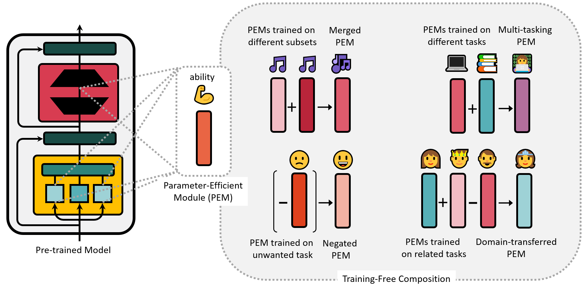

# Composing Parameter-Efficient Modules with Arithmetic Operations

\[News\] Our paper has been accepted to NeurIPS 2023 🎉🎉🎉

This is the official implementation of our NeurIPS 2023 paper [Composing Parameter-Efficient Modules with Arithmetic Operations](https://arxiv.org/abs/2306.14870), reproducing training-free composition of parameter-efficient modules (PEMs) with addition, negation and multicombination. The implementation of PEMs are based on [adapter-transformers](https://github.com/adapter-hub/adapter-transformers).

In parameter-efficient finetuning (PEFT), a lightweight module is learned on specific dataset while the underlying pretrained model remains unchanged, resulting in multiple compact modules representing diverse skills when applied to various domains and tasks. In this paper, we propose to compose these parameter-efficient modules through **linear arithmetic operations** in the weight space, thereby integrating different module capabilities. Specifically, we first define addition and negation operators for the module, and then further compose these two basic operators to perform flexible arithmetic. Our approach requires **no additional training** and enables highly flexible module composition.  We apply different arithmetic operations to compose the parameter-efficient modules for (1) distribution generalization, (2) multi-tasking, (3) unlearning, and (4) domain transfer. Additionally, we extend our approach to detoxify Alpaca-LoRA, the latest instruction-tuned large language model based on LLaMA. 



## Todos
- [ ] Release Alpaca-LoRA composition exps code
- [ ] Release 'instruction and toxic output' instruction tuning dataset
- [ ] Release test instruction sets with toxic ones and non-toxic ones

## Installation

`adapter-transformers` currently supports **Python 3.7+** and **PyTorch 1.3.1+**.
After downloading and unzipping, you can install by:

```
cd PEM_composition
pip install .
```

## Usage

You can use the tuning and merging shell scripts included in `exps` folder to train parameter-efficient modules and merge them. Here's an example to conduct *composition for distribution generalization* experiment:

Firstly, run `exps/composition_for_distribution_generalization/split_data.sh` to devide dataset into two subsets with different distribution. You can change the name or path of dataset and the storage path of the subset in this script.

```
bash exps/composition_for_distribution_generalization/split_data.sh
```

Secondly, run `fft_run_glue.sh`, `lora_run_glue.sh` or `ia3_run_glue.sh` under`exps/composition_for_distribution_generalization/` to train the model. Here we take LoRA training as an example. You can change the storage path of the subset in this script. As we require two modules trained on different distribution, this process should be conducted twice with each one of the two subsets.

```
bash exps/composition_for_distribution_generalization/lora_run_glue.sh
```

Lastly, run `dataset_split_merge.sh` under the same parent path to merge the two trained PEMs and evaluate them. Dataset name or path and storage path of PEMs should be set in this script. 

```
bash exps/composition_for_distribution_generalization/dataset_split_merge.sh
```

Tuning and merging shell scripts of experiments included in this paper are listed in `exps`: composition for distribution generalization, composition for multitasking, compostion for unlearning and composition for domain transfer. Composition operation are realised in `merge.py`, `analogy.py` and `negation.py`(applied in `exps\composition_for_unlearning\gpt2_scale.py`).

```
.
└── exps
    ├── composition_for_distribution_generalization
    │   ├── dataset_split_merge.sh
    │   ├── fft_run_glue.sh
    │   ├── ftdataset_split_merge.sh
    │   ├── ia3_run_glue.sh
    │   ├── lora_run_glue.sh
    │   └── split_data.sh
    ├── composition_for_domain_transfer
    │   ├── fft_polarity_classify.sh
    │   ├── fft_polarity_lm.sh
    │   ├── ia3_polarity_classify.sh
    │   ├── ia3_polarity_lm.sh
    │   ├── lora_polarity_classify.sh
    │   ├── lora_polarity_lm.sh
    │   └── vary_merge_analogy.sh
    ├── composition_for_multitasking
    │   ├── fft_prompt_run_glue.sh
    │   ├── ia3_prompt_run_glue.sh
    │   ├── lora_prompt_run_glue.sh
    │   └── vary_merge_prompt_run_glue.sh
    ├── composition_for_unlearning
    │   ├── composition_for_unlearning\fft.sh
    │   ├── gpt2_scale.py
    │   ├── README.md
    │   ├── requirements.txt
    │   ├── run_clm_noconcat.py
    │   ├── run_prediction.py
    │   ├── runscore.sh
    │   └── trainadapter.sh
    └── run_glue.sh
```


## Instruction Datasets
The instruction pair with toxic civil comment dataset we created via ChatGPT is in `openai_generate_datasets`, together with toxic and non-toxic instructions for evaluation.

## Citation
Please cite our paper if you use the data or code in this repo.
```
@inproceedings{zhang2023composing,
title={Composing Parameter-Efficient Modules with Arithmetic Operations}, 
author={Zhang, Jinghan and Chen, Shiqi and Liu, Junteng and He, Junxian},
booktitle={Advances in Neural Information Processing Systems},
year={2023}
}
```
